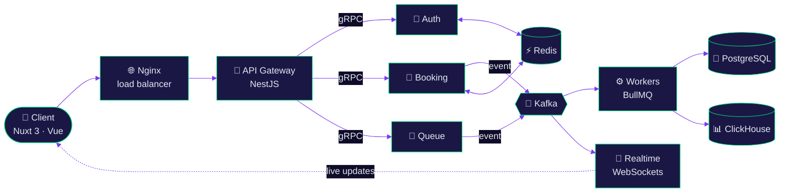

<!-- ═══════════════════════════ HEADER ═══════════════════════════ -->

  

  

  
  
  
  

 

<!-- ═══════════════════════════ HERO TERMINAL ═══════════════════════════ -->

  

 

<!-- ═══════════════════════════ ABOUT ═══════════════════════════ -->
<table align="center">
  <tr>
    <td width="68%" valign="top">

### 👨‍💻 About Me

I'm a **Fullstack Engineer** who loves the hard part of the stack — the part where thousands of events per second must land in the right place, exactly once, and the UI still feels instant.

- 🏛️ &nbsp;**Architecture** — Event-Driven, Microservices, REST &amp; gRPC APIs
- ⚡ &nbsp;**Now scaling with** — Kafka, Redis, BullMQ &amp; Docker
- 🧩 &nbsp;**Frontend** — Nuxt.js (Vue 3) with pixel-perfect, fast UIs
- 🌍 &nbsp;**Open to** — remote roles &amp; freelance projects
- 📫 &nbsp;**Reach me** — [jamshid14092002@gmail.com](mailto:jamshid14092002@gmail.com)

</td>
    <td width="32%" align="center" valign="middle">
      
        
      
    </td>
  </tr>
</table>

<!-- ═══════════════════════════ ARCHITECTURE ═══════════════════════════ -->
<h2 align="center">🏗️ How I Build Systems</h2>

A typical event-driven setup I design and ship to production

<!-- ═══════════════════════════ TECH STACK ═══════════════════════════ -->
<h2 align="center">🚀 Tech Stack</h2>

<table align="center">
  <tr>
    <td align="center" width="150"><b>🌐 Frontend</b></td>
    <td></td>
  </tr>
  <tr>
    <td align="center"><b>⚙️ Backend</b></td>
    <td></td>
  </tr>
  <tr>
    <td align="center"><b>🗄️ Data &amp; Brokers</b></td>
    <td></td>
  </tr>
  <tr>
    <td align="center"><b>🛠️ DevOps</b></td>
    <td></td>
  </tr>
</table>

<!-- ═══════════════════════════ WHAT I BUILD ═══════════════════════════ -->
<h2 align="center">🎯 What I Build</h2>

<table align="center">
  <tr>
    <td width="50%" valign="top">
      <h3>🏗️ Distributed Systems</h3>
      Microservices handling real-time data via <b>Kafka</b>, <b>WebSockets</b> and <b>gRPC</b>.
    </td>
    <td width="50%" valign="top">
      <h3>🚦 Complex Business Logic</h3>
      Advanced booking systems, smart queues (medical / CTF platforms) and real-time tracking (taxi &amp; transport).
    </td>
  </tr>
  <tr>
    <td width="50%" valign="top">
      <h3>⚡ Performance</h3>
      Background jobs with <b>BullMQ</b>, caching layers with <b>Redis</b>, optimized indexing in <b>PostgreSQL</b> &amp; <b>ClickHouse</b>.
    </td>
    <td width="50%" valign="top">
      <h3>🖥️ Full-Stack Magic</h3>
      Seamless <b>Vue / Nuxt</b> interfaces connected to robust <b>NestJS</b> architectures.
    </td>
  </tr>
</table>

<!-- ═══════════════════════════ PROJECTS ═══════════════════════════ -->
<h2 align="center">📌 Featured Projects</h2>

  
  
  
  

<!-- ═══════════════════════════ STATS ═══════════════════════════ -->
<h2 align="center">📊 GitHub Stats</h2>

  
  

  

  

  
<b>⏱️ WakaTime — coding time</b>

   
  

<!--START_SECTION:waka-->
<!--END_SECTION:waka-->

<!-- ═══════════════════════════ SNAKE ═══════════════════════════ -->

  <picture>
    <source media="(prefers-color-scheme: dark)" srcset="https://raw.githubusercontent.com/feylon/feylon/output/github-snake-dark.svg" />
    <source media="(prefers-color-scheme: light)" srcset="https://raw.githubusercontent.com/feylon/feylon/output/github-snake.svg" />
    
  </picture>

<!-- ═══════════════════════════ CONNECT ═══════════════════════════ -->
<h2 align="center">🌐 Let's Connect</h2>

  
  
  
  
  

<i>“Make it work, make it right, make it fast.” — Kent Beck</i>

<!-- ═══════════════════════════ FOOTER ═══════════════════════════ -->

  

